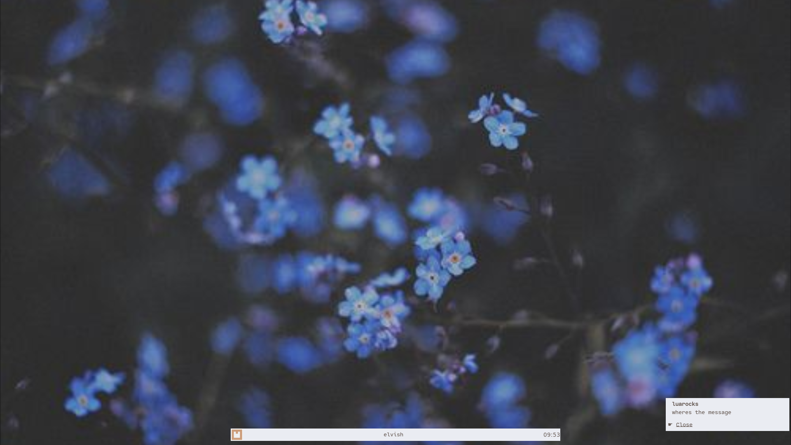

    
    

<h2 align="center" style="font-weight: bold"> my awesomewm dotfiles </h2>

## __Welcome__
 to my dotfiles!
Here are some details about my setup

- [Awesomewm](https://awesomewm.org/)
- [Elvish](https://elv.sh/)

## Gallery (in Progress....)

## Rices That inspired me..
[nuxshed](https://github.com/nuxshed/dotfiles)

### WOW! NixOS looks so god damn cool! I am just gonna jump right into it
NO. NixOS is hard.Don't be impatient and jump with the hype train. Nix files are complicated to make and can cause high brain damage. I recommend you to start with the nix package manager or using NixOS in a virtual machine instead of ripping apart your hard disk.